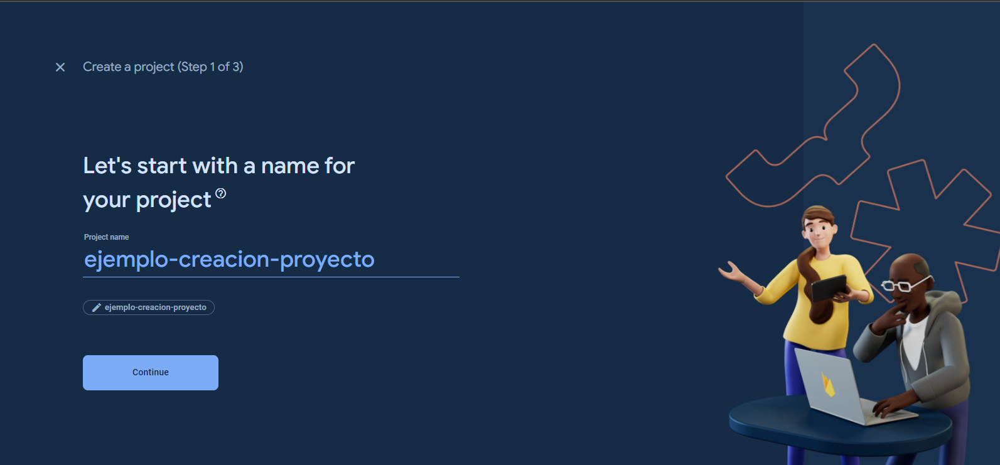
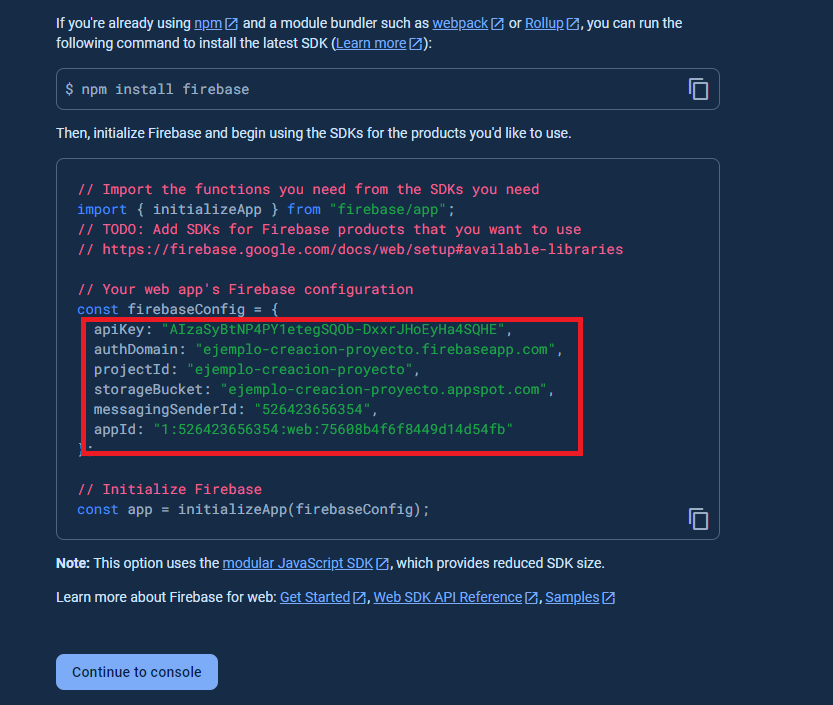
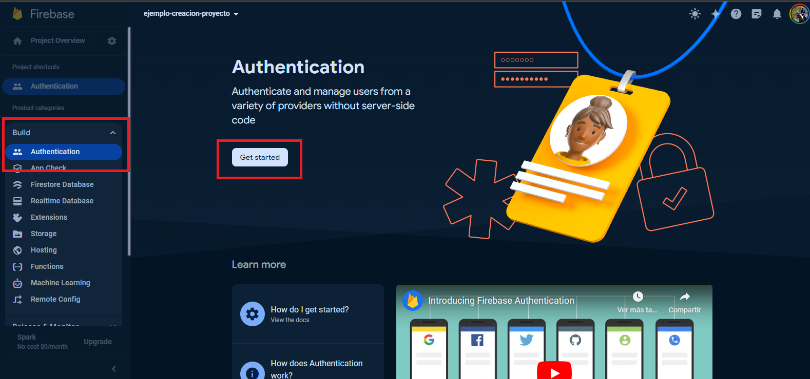
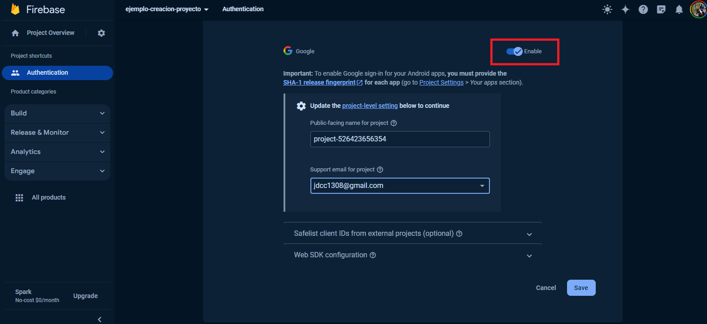
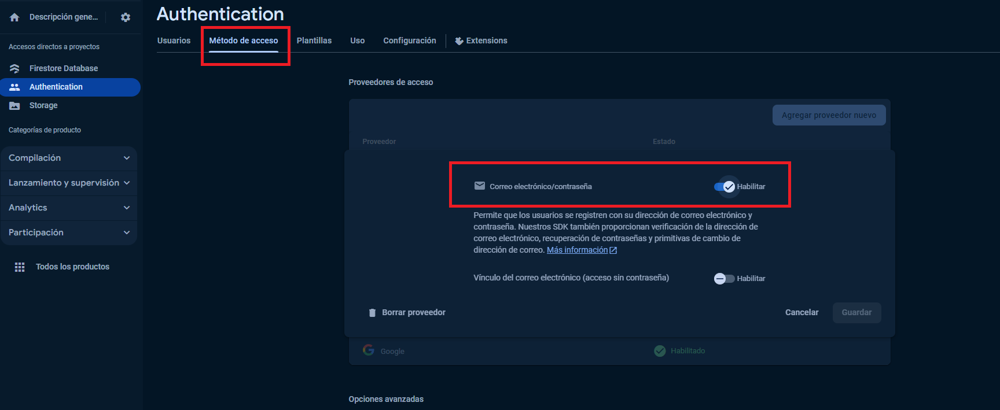
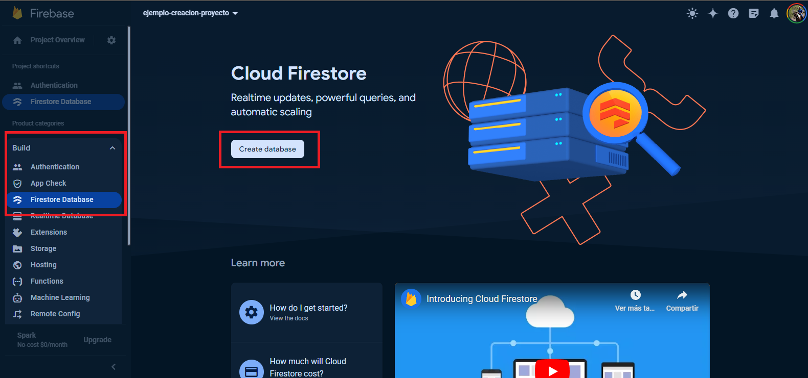
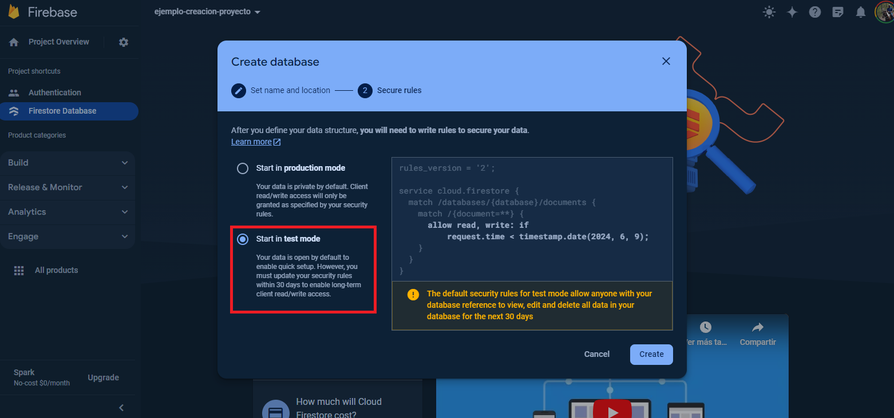
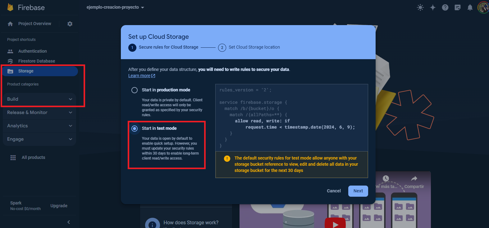

<a name="readme-top"></a>

# 🖥 Proyecto CRUD App

<p align="center">
    <a href="https://nodejs.org/en/download"></a>
    <a href="https://nodejs.org/en/download"></a>    
</p>

Este proyecto fue desarrollado como requerimiento para la asignatura de Desarrollo de Aplicaciones Web perteneciente al Departamento de Telemática del programa de Ingeniería en Electrónica y Telecomunicaciones de la Universidad del Cauca. El objetivo específico del desarrollo del proyecto es reforzar los conceptos más importantes para la implementación de aplicaciones web desde el desarrollo FrontEnd.

## 📖 Instrucciones de uso
Para replicar este proyecto, debe realizar los siguientes pasos:

### 1️⃣ Configurar Firebase

* #### Crear el proyecto
    Para crear el nuevo proyecto utilizando Firebase como Backend as a Service (BaaS), debe ingresar a:

    [Consola de Firebase](https://console.firebase.google.com/)

    Después, debe dar click en "Agregar proyecto". 

    

* #### Crear la aplicación web
    Para crear la nueva aplicación web, debe dar click en el icono web `</>` en la sección "Agregar Firebase a su aplicación". Una vez en esta vista, debe asignarle un nombre a su aplicación web y paso seguido debe almacenar los valores de configuración de su aplicación (como los presentados a manera de ejemplo en la siguiente imagen), para poderlos configurar como variables de entorno más adelante.

    

* #### Habilitar la autenticación con Google
    Una vez que ya ha generado correctamente su proyecto y ha configurado su aplicación web para que funcione la autenticación de la aplicación, debe configurar a Google como proveedor. Para ello, en el panel lateral izquierdo debe observar una sección que dice "Build", dentro de ella encontrará una subsección que dice "Authentication". Dando click en esa subsección, también deberá dar un click en el botón "Get Started". La imagen a continuación lo guiará de manera visual.

    

    Después debe dar click en el botón "Google", y habilitarlo como proveedor de autenticación. La imagen a continuación lo guiará de manera visual.

    

* #### Habilitar la autenticación con correo y contraseña

    En la misma subsección que dice "Authentication", debe habilitar la autenticación con correo y contraseña. La imagen a continuación lo guiará de manera visual.

    

* #### Habilitar Firestore
    Las base de datos en Firestore es el método de persistencia más famoso que brinda Firebase a sus usuarios. Para habilitarlo, nuevamente en el panel lateral izquierdo en la sección "Build" debe seleccionar la subsección "Firestore". Nuevamente debe dar click en el botón "Create database". La imagen a continuación lo guiará de manera visual.

    

    Otro punto importante en la habilitación de Firestore es la configuración de las reglas de seguridad. Para este caso, el proyecto está en estado de desarrollo, por este motivo debe seleccionar la opción "Start in test mode". La imagen a continuación lo guiará de manera visual.

    

* #### Habilitar Storage
    Storage es una opción muy útil brindada por Firebase para el almacenamiento de recursos audiovisuales de forma sencilla pero eficiente. De forma similar al paso anterior, en la sección "Build" debe seleccionar la subsección "Storage" y configurar las reglas de seguridad seleccionando la opción "Start in test mode". La imagen a continuación lo guiará de manera visual.

    


### 2️⃣ Clonar el repositorio
Una vez ha configurado Firebase, para clonar el repositorio en su entorno local ejecute:

```
git clone http://github.com/jdcarvajalc/crud-react-app.git
```

No olvide dejar su estrella ⭐ a este repositorio por favor!

### 3️⃣ Instalar dependencias
En su consola de preferencia ejecute:

```
npm install
```

### 4️⃣ Configurar las variables de entorno

> [!CAUTION]
> No comparta sus variables de entorno

Es importante que sean cambiadas las variables de entorno en el archivo [.env_example](./.env_example), reemplazando `YOURS` en cada de una de ellas con los datos proporcionados en la creación de la aplicación web con Firebase.

`REACT_APP_FIREBASE_API_KEY="YOURS"`

`REACT_APP_FIREBASE_AUTH_DOMAIN="YOURS"`

`REACT_APP_FIREBASE_PROJECT_ID="YOURS"` 

`REACT_APP_FIREBASE_STORAGE_BUCKET="YOURS"`

`REACT_APP_FIREBASE_MESSAGING_SENDER_ID="YOURS"`

`REACT_APP_FIREBASE_APP_ID="YOURS"`


Después, para que funcionen las variables de entorno debe cambiar el nombre del archivo [.env_example](./.env_example) a `.env` en su repositorio local.

### 5️⃣ Ejecutar el proyecto de forma local
Una vez que haya terminado de instalar las dependencias y haya configurado las variables de entorno, puede ejecutar el proyecto. En su consola de preferencia ejecute:

```
npm start
```

Este comando ejecuta la aplicación en modo de desarrollo.\
Abra [http://localhost:3000](http://localhost:3000) para verla en su navegador de preferencia.

<p align="right"><a href="#readme-top">⬆ Volver arriba ⬆</a></p>

## 🎨 Referencia de colores

| Color             | Hex                                                                |
| ----------------- | ------------------------------------------------------------------ |
| Color principal |  #1f3c4d |
| Color de título |  #0d1e2b |
| Color de texto |  #45637d |
| Color de texto claro |  #afafb8 |
| Color de borde |  #a0a7ac |
| Color de contenedor |  #fff |
| Color de cuerpo |  #fafbfb |

<p align="right"><a href="#readme-top">⬆ Volver arriba ⬆</a></p>


##  🛠️  Stack

- 

- 

- 


- 

- 

- 

- 

- 

- 

<p align="right"><a href="#readme-top">⬆ Volver arriba ⬆</a></p>
